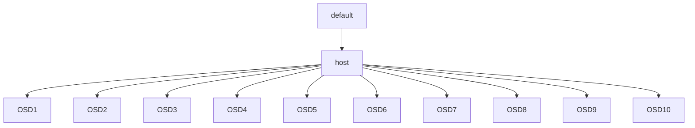

# 2018.9.3

## Linux

### screen

通过screen，我们可以两个人同时处理同一个终端，比如远程协助定位等。

**1. 安装**

```bash
$ sudo apt-get install screen
```

**2. 协同**

A在终端上启动一个screen session

```bash
$ screen -S session-name
```

B连接上同一个screen session

```bash
$ screen -x session-name
```

这样两边的操作就是实时且同步的了。

**3.退出**

```bash
$ exit
```

参考链接：[Linux下利用screen进行屏幕协作](http://xiaqunfeng.cc/2017/01/11/Linux%E4%B8%8B%E5%88%A9%E7%94%A8screen%E8%BF%9B%E8%A1%8C%E5%B1%8F%E5%B9%95%E5%8D%8F%E4%BD%9C/)

### dd命令

```bash
$ dd --help
Usage: dd [OPERAND]...
  or:  dd OPTION
Copy a file, converting and formatting according to the operands.

  bs=BYTES        read and write up to BYTES bytes at a time
  if=FILE         read from FILE instead of stdin
  of=FILE         write to FILE instead of stdout
  oflag=FLAGS     write as per the comma separated symbol list
  seek=N          skip N obs-sized blocks at start of output
  skip=N          skip N ibs-sized blocks at start of input
  conv=CONVS      convert the file as per the comma separated symbol list
  count=N         copy only N input blocks

  
N and BYTES may be followed by the following multiplicative suffixes:
c =1, w =2, b =512, kB =1000, K =1024, MB =1000*1000, M =1024*1024, xM =M
GB =1000*1000*1000, G =1024*1024*1024, and so on for T, P, E, Z, Y.

Each CONV symbol may be:
  ...
  sync      pad every input block with NULs to ibs-size; when used
  ...
  fdatasync  physically write output file data before finishing
  fsync     likewise, but also write metadata
  
Each FLAG symbol may be:
...
  direct    use direct I/O for data
...
```

| 选项  | 意义                                             |
| ----- | ------------------------------------------------ |
| bs    | 同时设置读写块的大小为 bytes ，可代替 ibs 和 obs |
| conv  | 转换参数                                         |
| count | 复制的块数                                       |
| if    | 输入文件 或 设备名称                             |
| iflag | 按照逗号来分隔读参数                             |
| of    | 输出文件 或 设备名称                             |
| oflag | 按照逗号来分隔写参数                             |
| seek  | 从输出文件开头跳过 blocks 个块后再开始复制       |
| skip  | 从输入文件开头跳过 blocks 个块后再开始复制       |

**两个特殊的设备**

* `/dev/null`：伪设备，相当于黑洞，of到该设备不会产生IO
* `dev/zero`：伪设备，它只产生空字符流，对它不会产生IO

**1.测试写能力**

```bash
$ dd bs=8k count=4k if=/dev/zero of=test.log conv=fdatasync
或者
$ dd bs=8k count=4k if=/dev/zero of=test.log conv=fsync 
```

不加conv选项时会有写缓存，所有测出来的数据并不准确。

**2. 测试写能力**

```bash
$ dd if=/dev/sdb1 of=/dev/null bs=8k count=10000
```

**3. 测试测试读写能力**

```bash
$ dd if=/dev/sdb1 of=/test.a bs=8k count=10000
```


考链接：

1. [dd磁盘命令小记 | 夏天的风的博客](http://xiaqunfeng.cc/2017/01/12/dd%E7%A3%81%E7%9B%98%E5%91%BD%E4%BB%A4%E5%B0%8F%E8%AE%B0/)
2. [正确的使用dd进行磁盘读写速度测试 - 赵磊的技术博客 - ITeye博客](http://elf8848.iteye.com/blog/2089055)

### mount

* `mount [-l] [-t type]`: lists all mounted filesystems (of type type).  The option -l adds the labels in this listing.  See below.

## Ceph

## journal

1. [影响性能的关键部分-ceph的osd journal写 - rodenpark - 博客园](http://www.cnblogs.com/rodenpark/p/6223320.html)
2. [ceph如何设置journal使用SSD而数据盘使用SATA - 程序园](http://www.voidcn.com/article/p-omjkpoaz-bkq.html)
3. [Ceph的Journal机制 | tianshan's blog](http://www.quts.me/ceph-journal/)
4. [CEPH文件系统元数据的SSD加速](http://www.ssdfans.com/blog/2017/08/03/ceph%E6%96%87%E4%BB%B6%E7%B3%BB%E7%BB%9F%E5%85%83%E6%95%B0%E6%8D%AE%E7%9A%84ssd%E5%8A%A0%E9%80%9F/)

## 遇到问题

`ceph`集群的`pg`一直是` active+undersized`和`active+undersized+degraded`的问题

```bash
[root@mon01 ~]# ceph pg stat
640 pgs: 127 active+undersized+degraded, 513 active+undersized; 1.6 KiB data, 11 GiB used, 80 TiB / 80 TiB avail; 452/678 objects degraded (66.667%)
```

[Ceph文档](http://docs.ceph.com/docs/master/rados/operations/pg-states/z)中对这三个状态的定义是

- `active`：Ceph will process requests to the placement group. 

  Ceph会处理对PG的请求

- `degraded`：Ceph has not replicated some objects in the placement group the correct number of times yet. 

  Ceph没有复制PG里的object够正确的次数

- `undersized`：The placement group has fewer copies than the configured pool replication level. 

  PG的副本数少于存储池设定的副本等级。

总结起来就是：**Ceph存储的PG副本数不足，但仍能正常向OSD存储数据**。

上面一共640个pg， 其中所有的pg都是undersize的，表示这些pg的副本数都少于储存池设定的副本数。

参考链接：

1. [ceph pg state简介 | luqitao's Blog.](http://luqitao.github.io/2016/07/14/ceph-pg-states-introduction/)
2. [Placement Group States — Ceph Documentation](http://docs.ceph.com/docs/master/rados/operations/pg-states/)
3. [ceph placement group | 夏天的风的博客](http://xiaqunfeng.cc/2017/07/28/ceph-placement-group/)

## 问题定位

1. **查看每个pool的size设置**

   ```bash
   [root@mon01 ~]# for pool in $(ceph osd lspools|awk '{print $2}');do ceph osd pool get ${pool} min_size;done
   min_size: 1
   min_size: 1
   min_size: 1
   min_size: 1
   min_size: 1
   [root@mon01 ~]# for pool in $(ceph osd lspools|awk '{print $2}');do ceph osd pool get ${pool} size;done
   size: 3
   size: 3
   size: 3
   size: 3
   size: 3
   ```

2. **查看存储结构**

```bash
[root@mon01 ~]# ceph osd tree
ID CLASS WEIGHT   TYPE NAME      STATUS REWEIGHT PRI-AFF
-1       80.05128 root default
-3       80.05128     host mon01
 0   hdd  7.27739         osd.0      up  1.00000 1.00000
 1   hdd  7.27739         osd.1      up  1.00000 1.00000
 2   hdd  7.27739         osd.2      up  1.00000 1.00000
 3   hdd  7.27739         osd.3      up  1.00000 1.00000
 4   hdd  7.27739         osd.4      up  1.00000 1.00000
 5   hdd  7.27739         osd.5      up  1.00000 1.00000
 6   hdd  7.27739         osd.6      up  1.00000 1.00000
 7   hdd  7.27739         osd.7      up  1.00000 1.00000
 8   hdd  7.27739         osd.8      up  1.00000 1.00000
 9   hdd  7.27739         osd.9      up  1.00000 1.00000
10   hdd  7.27739         osd.10     up  1.00000 1.00000
```

直观点来看就是



1. **然后查看CRUSH规则**

   ```bash
   [root@mon01 test]# ceph osd getcrushmap -o crush-map-raw
   [root@mon01 test]# crushtool -d crush-map-raw -o crush.txt
   [root@mon01 test]# Vim crush.txt
   #...省略前面部分
   
   # rules
   rule replicated_rule {
           id 0
           type replicated
           min_size 1
           max_size 10
           step take default  # 首先选择default
           step chooseleaf firstn 0 type host  # 从defult的所有叶节点（即default下的所有host，选择每个host下的一个OSD节点。所以现在每个PG都只放到了一个OSD里面）
           step emit
   }
   ```

## 解决方案

**调整CRUSH策略**

```bash
# rules
rule replicated_rule {
        id 0
        type replicated
        min_size 1
        max_size 10
        step take default  # 首先选择default
        step choose firstn 1 type host # 选择host,因为目前只有一台机器
        step choose firstn 3 type osd # 选择这台host下的所有osd
        step emit
}
```


1. [管理 Crushmap - 《Ceph 运维手册》 - 书栈网(BookStack.CN)](https://www.bookstack.cn/read/ceph-handbook/Operation-manage_crushmap.md)